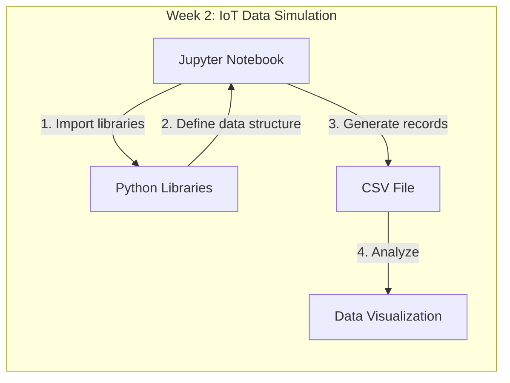
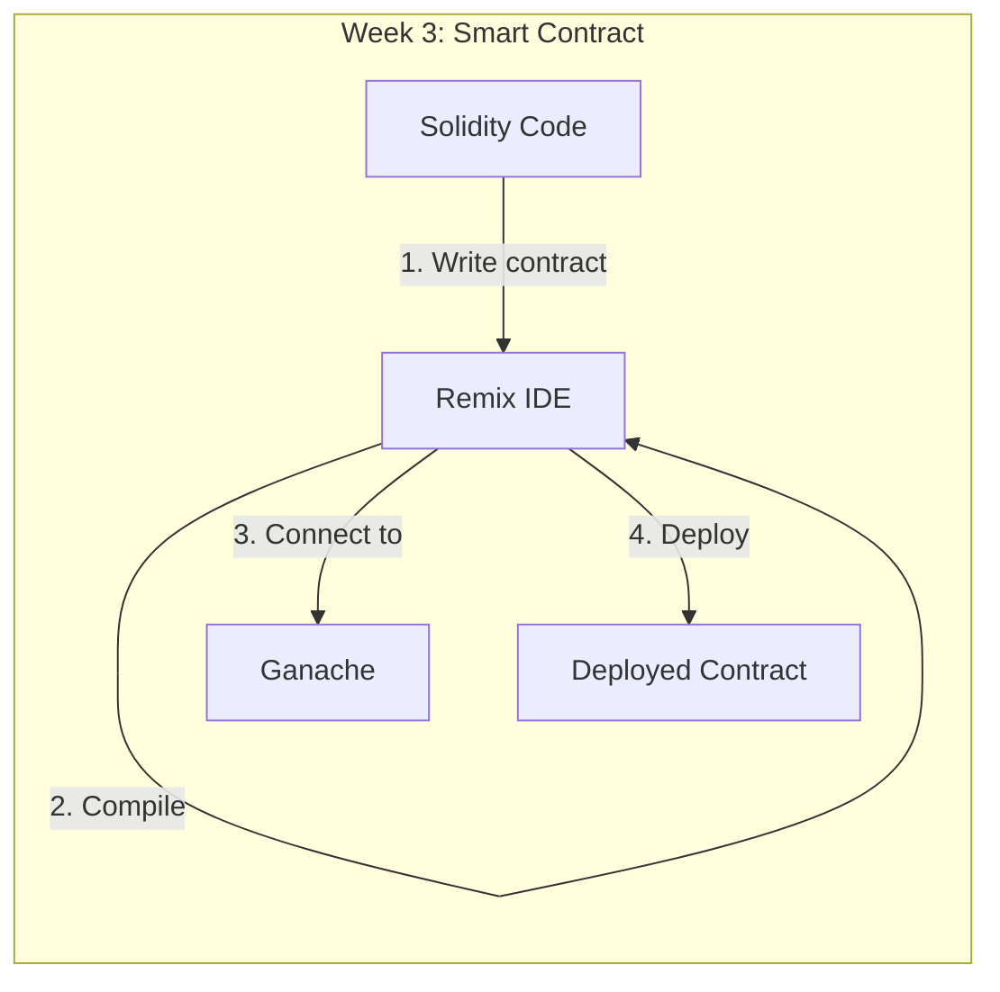
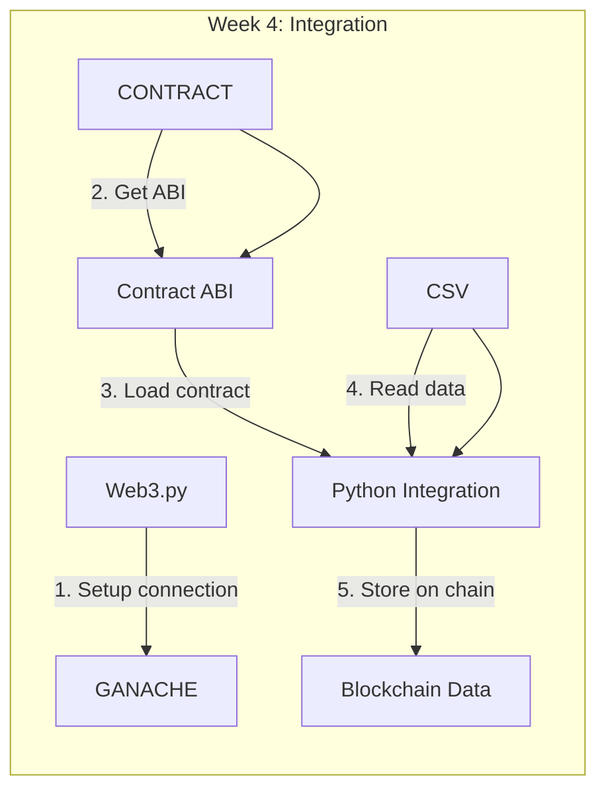
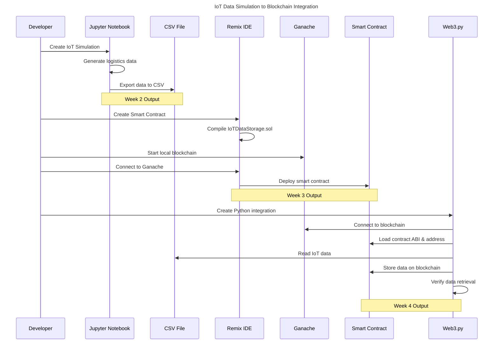

# The Journey from IoT Data Simulation to Smart Contracts: A Developer's Tale

## Chapter 1: The Beginning - IoT Data Simulation

It all began in Week 2 when I was tasked with simulating IoT data for a smart logistics tracking system. Like any good developer, I started by understanding the requirements: create realistic data that mimics how IoT sensors would track packages in the real world.



I chose Jupyter Notebook as my canvas—a perfect tool for this task since it allows me to combine code, visualizations, and documentation in one interactive document. Looking at the template provided (`MO-IT148_Homework_IoT_Data_Simulation_S3101_Group_x.ipynb`), I could see the structure already laid out for me.

```python
import pandas as pd
import numpy as np
import random
from datetime import datetime, timedelta
```

The first critical decision was determining what data to generate. Since I was simulating a logistics tracking system, I needed:

- GPS coordinates (latitude/longitude)
- Package identifiers (RFID tags and package IDs)
- Environmental data (temperature readings)
- Device information
- Timestamps

The heart of the simulation was this function:

```python
def generate_logistic_data(num_records=50):
    data = []
  
    # Started with coordinates around Manila
    current_latitude = 14.5995 
    current_longitude = 120.9842
  
    start_time = datetime.now()

    for i in range(num_records):
        # Added small time progression with jitter for realism
        record_timestamp = start_time + timedelta(minutes=i*5 + random.randint(-2,2))
  
        # Created realistic but random package IDs and RFID tags
        package_id = f"PKG{1000 + i + random.randint(0,5)}"
        rfid_tag = f"RFID_{random.randint(10000000, 99999999)}_{random.choice(['A','B','C'])}"

        # Added small movement to simulate packages moving through a city
        lat_change = random.uniform(-0.005, 0.005)
        lon_change = random.uniform(-0.005, 0.005)
        current_latitude += lat_change
        current_longitude += lon_change
  
        # Simulated refrigerated goods with occasional temperature spikes
        base_temp = 5.0
        temperature_celsius = round(base_temp + random.uniform(-1.5, 1.5), 2)
  
        # Added different tracker devices
        device_id = f"Tracker_Dev_{101 + (i%5)}"
  
        # Created the record and added it to our dataset
        record = {
            "Timestamp": record_timestamp.strftime('%Y-%m-%d %H:%M:%S'),
            "PackageID": package_id,
            "RFIDTag": rfid_tag,
            "Latitude": current_latitude,
            "Longitude": current_longitude,
            "Temperature_C": temperature_celsius,
            "DeviceID": device_id
        }
        data.append(record)
  
    return pd.DataFrame(data)
```

I generated 100 records, explored the data through pandas, and visualized it using Plotly. The final step was saving it to a CSV file (`simulated_logistic_iot_data.csv`), which would become crucial later:

```python
iot_df.to_csv("simulated_logistic_iot_data.csv", index=False)
```

## Chapter 2: Into the Blockchain - Smart Contract Development

As Week 3 arrived, a new challenge emerged: creating a smart contract to store this IoT data on the blockchain. This would transform our simulated data into immutable records.



I began by studying the Solidity language and how smart contracts work. The task was to create a contract that could:

1. Store logistics data securely
2. Keep track of all records
3. Allow retrieval of data when needed
4. Limit access to authorized users

Opening Remix IDE in the browser (remix.ethereum.org), I created a new file called IoTDataStorage.sol. After reviewing examples and documentation, I structured my contract:

```solidity
// SPDX-License-Identifier: MIT
pragma solidity ^0.8.0;

contract LogisticsDataStorage {
    struct LogisticsRecord {
        uint256 blockchainTimestamp;
        string originalTimestamp;
        string packageId;
        string rfidTag;
        string latitude;
        string longitude;
        string temperatureC;
        string deviceId;
    }

    uint256 public constant MAX_ENTRIES = 100;
    LogisticsRecord[] public logisticsRecords;
    address public owner;
  
    // Only contract owner can add records
    modifier onlyOwner() {
        require(msg.sender == owner, "Not authorized");
        _;
    }
  
    constructor() {
        owner = msg.sender;
    }
  
    // Main function for storing our IoT data
    function storeLogisticsData(
        string memory _originalTimestamp,
        string memory _packageId,
        string memory _rfidTag,
        string memory _latitude,
        string memory _longitude,
        string memory _temperatureC,
        string memory _deviceId
    ) public onlyOwner {
        // Prevent exceeding storage capacity
        require(logisticsRecords.length < MAX_ENTRIES, "Storage limit reached");
  
        // Create and store the record
        logisticsRecords.push(LogisticsRecord(
            block.timestamp,
            _originalTimestamp,
            _PackageId,
            _rfidTag,
            _latitude,
            _longitude,
            _temperatureC,
            _deviceId
        ));
  
        // Emit event for offchain monitoring
        emit LogisticsDataStored(
            block.timestamp,
            _originalTimestamp,
            _packageId,
            _rfidTag,
            _latitude,
            _longitude,
            _temperatureC,
            _deviceId
        );
    }
  
    // Get total number of records
    function getTotalRecords() public view returns (uint256) {
        return logisticsRecords.length;
    }
  
    // Retrieve a specific record by index
    function getLogisticsRecord(uint256 index) public view returns (
        uint256, string memory, string memory, string memory,
        string memory, string memory, string memory, string memory
    ) {
        require(index < logisticsRecords.length, "Index out of bounds");
        LogisticsRecord memory record = logisticsRecords[index];
        return (
            record.blockchainTimestamp,
            record.originalTimestamp,
            record.packageId,
            record.rfidTag,
            record.latitude,
            record.longitude,
            record.temperatureC,
            record.deviceId
        );
    }
  
    // Event for monitoring record additions
    event LogisticsDataStored(
        uint256 blockchainTimestamp,
        string originalTimestamp,
        string packageId,
        string rfidTag,
        string latitude,
        string longitude,
        string temperatureC,
        string deviceId
    );
}
```

I designed this structure carefully to:

1. Match the CSV format from Week 2
2. Include security controls (only owner can add records)
3. Prevent data storage overflow with MAX_ENTRIES
4. Create proper getters for accessing the data
5. Use events for external monitoring

After writing the contract, compiling was next. I selected the Solidity Compiler tab in Remix, chose compiler version 0.8.0 (matching my pragma statement), and clicked "Compile". Watching for warnings or errors, I was relieved when it compiled successfully—a green checkmark appeared!

## Chapter 3: Deploying to Ganache - Local Blockchain

Now I needed a blockchain to deploy to. Rather than using the expensive public Ethereum network, Ganache provided a perfect local test blockchain. I downloaded and installed Ganache, clicked "Quickstart Ethereum," and was greeted with 10 pre-funded accounts.

Back in Remix, I navigated to the "Deploy & Run Transactions" tab. This is where I encountered my first real challenge—I couldn't find the "Web3 Provider" option mentioned in the instructions! After some searching, I discovered it had been renamed to "External HTTP Provider" in newer versions.

I selected this option and entered Ganache's RPC URL: `http://127.0.0.1:7545`. After confirming the connection, I selected my contract from the dropdown and clicked "Deploy". The contract deployed successfully, and Remix showed it under "Deployed Contracts."

I carefully noted the contract address (`0xa56e14ab07f139b9fa1569bb1374c0dd088fb039`) and tested some interactions:

1. Called `owner()` to verify my account was set as the owner
2. Called `getTotalRecords()` which returned 0 (empty contract)
3. Manually tested `storeLogisticsData()` with sample values

Everything worked! My smart contract was now ready to receive real data.

## Chapter 4: Bridging the Gap - Python Integration

The final challenge in Week 4 was connecting Python to the blockchain—linking our IoT simulation to our smart contract. I created a new Jupyter notebook (W4.ipynb) for this purpose.



First, I needed to install the Web3.py library:

```python
!pip install web3 pandas
```

The most critical part was configuring the connection correctly:

```python
from web3 import Web3
import json

# Configuration
GANACHE_URL = "http://127.0.0.1:7545"
CONTRACT_ADDRESS = "0xa56e14ab07f139b9fa1569bb1374c0dd088fb039"

# This was tricky! I needed to copy the ABI from Remix after compilation
CONTRACT_ABI_JSON = '''
[
    {
        "inputs": [],
        "stateMutability": "nonpayable",
        "type": "constructor"
    },
    {
        "anonymous": false,
        "inputs": [
            {"indexed": false, "internalType": "uint256", "name": "blockchainTimestamp", "type": "uint256"},
            {"indexed": false, "internalType": "string", "name": "originalTimestamp", "type": "string"},
            {"indexed": false, "internalType": "string", "name": "packageId", "type": "string"},
            {"indexed": false, "internalType": "string", "name": "rfidTag", "type": "string"},
            {"indexed": false, "internalType": "string", "name": "latitude", "type": "string"},
            {"indexed": false, "internalType": "string", "name": "longitude", "type": "string"},
            {"indexed": false, "internalType": "string", "name": "temperatureC", "type": "string"},
            {"indexed": false, "internalType": "string", "name": "deviceId", "type": "string"}
        ],
        "name": "LogisticsDataStored",
        "type": "event"
    },
    # ... rest of ABI ...
]
'''

# Connect to Ganache
web3 = Web3(Web3.HTTPProvider(GANACHE_URL))
if web3.is_connected():
    print(f"✅ Connected to Ganache successfully!")
else:
    print(f"❌ Connection failed!")
    exit()
```

I encountered a hurdle here—initially confusing the contract bytecode hash (`0x63c8bf...`) with the actual ABI. After researching, I understood that the ABI is a JSON description of the contract's interface, not a hash. I went back to Remix, clicked the "ABI" button in the compiler section, and copied the full JSON.

With the connection established, I implemented the core functionality:

```python
# Load the contract
contract_abi = json.loads(CONTRACT_ABI_JSON)
contract = web3.eth.contract(address=web3.to_checksum_address(CONTRACT_ADDRESS), abi=contract_abi)

# Set the sender account (must be the contract owner)
default_sender_account = web3.eth.accounts[0]

# Store a test record
dummy_data = {
    "_originalTimestamp": "2025-01-01 12:00:00",
    "_packageId": "PKG_PYTHON_001",
    "_rfidTag": "RFID_PY_TEST",
    "_latitude": "10.12345",
    "_longitude": "120.54321",
    "_temperatureC": "22.5",
    "_deviceId": "Tracker_Py_01"
}

tx_hash = contract.functions.storeLogisticsData(
    dummy_data["_originalTimestamp"],
    dummy_data["_packageId"],
    dummy_data["_rfidTag"],
    dummy_data["_latitude"],
    dummy_data["_longitude"],
    dummy_data["_temperatureC"],
    dummy_data["_deviceId"]
).transact({'from': default_sender_account, 'gas': 1500000})

# Wait for transaction to be mined
receipt = web3.eth.wait_for_transaction_receipt(tx_hash)
if receipt.status == 1:
    print("✅ Data stored successfully!")
else:
    print("❌ Transaction failed!")

# Verify by retrieving the record
total_records = contract.functions.getTotalRecords().call()
if total_records > 0:
    record = contract.functions.getLogisticsRecord(total_records - 1).call()
    print(f"Retrieved Package ID: {record[2]}")
```

The most challenging part was ensuring the transaction parameters were correct—particularly using the right account (the contract owner) and providing enough gas. After some trial and error, I got it working!

## Chapter 5: The Full Circle - From CSV to Blockchain

With all components working, I could now extend the script to read from our Week 2 CSV file and store all records on the blockchain:

```python
import pandas as pd

# Load our simulated IoT data
csv_path = "WEEK-2/simulated_logistic_iot_data.csv"
iot_data = pd.read_csv(csv_path)

print(f"Loaded {len(iot_data)} records from CSV")

# Store each record on the blockchain
for index, row in iot_data.iterrows():
    # Only store a subset for demo purposes (to save gas)
    if index >= 5:  # Store only first 5 records
        break
  
    print(f"Processing record {index+1}/5: {row['PackageID']}...")
  
    # Create transaction
    tx_hash = contract.functions.storeLogisticsData(
        row['Timestamp'],
        row['PackageID'],
        row['RFIDTag'],
        str(row['Latitude']),
        str(row['Longitude']),
        str(row['Temperature_C']),
        row['DeviceID']
    ).transact({'from': default_sender_account, 'gas': 1500000})
  
    # Wait for transaction to be mined
    receipt = web3.eth.wait_for_transaction_receipt(tx_hash)
    if receipt.status == 1:
        print(f"  ✅ Record {index+1} stored successfully!")
    else:
        print(f"  ❌ Record {index+1} failed!")

print("Data integration complete!")
```

I limited it to 5 records to save execution time and gas costs, but the principle would work for all records.



## Epilogue: Reflections on the Journey

Looking back at this journey from Week 2 to Week 4, I'm amazed at how we started with simple simulated data and ended with a complete blockchain solution. The process taught me:

1. **Data Modeling** - How to structure data for both traditional storage and blockchain
2. **Solidity Programming** - Writing secure, efficient smart contracts
3. **Local Blockchain Development** - Using Ganache to test without costs or risks
4. **Web3 Integration** - Connecting Python applications to blockchain networks

The most valuable learning was understanding the full stack: from generating IoT data, to storing it permanently on a blockchain, to retrieving it when needed. This end-to-end perspective shows how emerging technologies can work together to create trustworthy, immutable systems that track real-world objects and events.

This knowledge could be applied to countless real-world scenarios—from supply chain verification to healthcare record management to environmental monitoring. The future is bright for IoT and blockchain integration!
